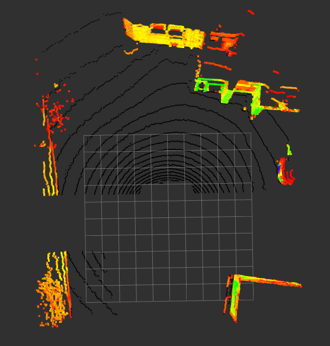
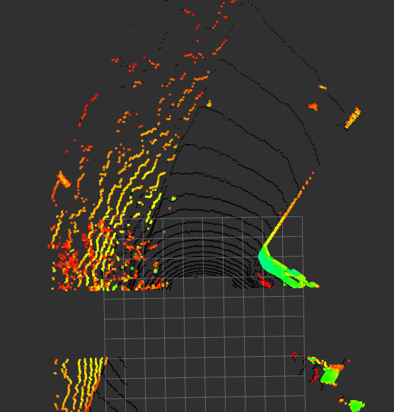

# LiDAR Filtering & Slope-Based Ground Segmentation (ROS 2)

A high-performance **ROS 2 composable perception node** for real-time ground segmentation using a **scanline-based slope evaluation method**, designed and validated on a **64-channel 3D LiDAR**.

This package processes raw point cloud data, applies spatial constraints, organizes points in polar coordinates, and performs **ring-to-ring slope analysis** to separate ground points from obstacles in autonomous driving scenarios.

https://github.com/user-attachments/assets/098fde6c-d19e-496e-8971-ea2f183805b0

---

## Hardware Platform

This implementation is developed and tuned for the **OUSTER OS0 64 Channel** LiDAR sensor.

**Key sensor characteristics used in this work:**
- 64 vertical channels
- 90° vertical field-of-view (+45° to -45°)
- Configurable horizontal resolution (512 / 1024 / 2048)
- 10–20 Hz rotation rate
- Dual return support
- <10 ms latency

The algorithm assumes:
- Fixed ring indices
- Known sensor mounting height
- Full 360° horizontal sweep

---

## Design Goals

- **Deterministic real-time performance**
- **No iterative plane fitting (RANSAC-free)**
- **Low computational overhead**
- **Robustness to noise and small surface irregularities**
- **ROS 2 intra-process zero-copy compatibility**

---

## Features

- **Spatial Cropping**
  - Front/rear, lateral (Y), and vertical (Z) bounds
  - Reduces unnecessary computation early in the pipeline

- **Polar Coordinate Organization**
  - Points are grouped by LiDAR ring
  - Sorted by azimuth for deterministic scanline processing

- **Slope-Based Ground Segmentation**
  - Ring-to-ring comparison using geometric slope constraints
  - Global ground seeding using sensor height priors
  - Noise and obstacle height rejection

- **Optional Voxel Grid Downsampling**
  - Applied only to non-ground points
  - Reduces load on downstream clustering or planning modules

- **Composable ROS 2 Node**
  - Built using `rclcpp_components`
  - Supports zero-copy intra-process communication

---

## Algorithm Overview

### 1. Spatial Filtering

Incoming points are filtered using configurable bounds:

- X-axis: front & rear ranges
- Y-axis: lateral crop
- Z-axis: vertical crop

This removes irrelevant regions before segmentation.

---

### 2. Polar Organization

Each point is converted to polar coordinates:

- **Range (r)** = √(x² + y²)  
- **Azimuth (θ)** = atan2(y, x)

After conversion:

- Points are assigned to their corresponding **LiDAR ring**  
- Sorted by azimuth angle within each ring for deterministic scanlines

---

### 3. Ground Initialization

For each azimuth bin, the initial ground candidate is determined using a known **sensor height**:

- A point is considered ground if |z + sensor_height| < ground_tolerance  
- This provides a stable starting reference for incremental ground propagation

---

### 4. Ring-to-Ring Slope Evaluation

For subsequent points along the same azimuth:

- Horizontal distance: d_xy = √((x_i - x_prev)² + (y_i - y_prev)²)  
- Vertical difference: d_z = |z_i - z_prev|

A point is classified as **ground** if:

- d_z < d_xy × tan(slope_threshold)

Additional rules:

- Points exceeding the obstacle height threshold → non-ground  
- Points with very small d_z and non-zero horizontal separation → ground (noise suppression)  
- Points satisfying global ground height prior → ground
Additional rules:
- Immediate obstacle rejection if `d_z > obstacle_height_thresh`
- Noise suppression if `d_z < noise_floor`
- Global ground override when height prior is satisfied

This enables robust ground tracking across uneven terrain without explicit plane fitting.

---

## Why Not RANSAC?

| RANSAC Plane Fitting | This Method |
|---------------------|------------|
| Iterative & stochastic | Fully deterministic |
| High CPU usage | Lightweight & fast |
| Sensitive to outliers | Robust via incremental constraints |
| Frame-wide assumption | Azimuth-local continuity |

This makes the approach suitable for **real-time embedded autonomous systems**.

---

## ROS 2 Node Architecture

The processing pipeline of the node is structured as follows:

```text
sensor_msgs::msg::PointCloud2 (raw input)
                │
                ▼
        Spatial Cropping
 (X / Y / Z bounding constraints)
                │
                ▼
     Polar Organization
 (Ring indexing + Azimuth sorting)
                │
                ▼
 Slope-Based Ground Segmentation
 (Ring-to-ring geometric evaluation)
                │
                ▼
      ┌─────────────────────┬─────────────────────┐
      │     Ground Cloud    │   Non-Ground Cloud  │
      │   (/ground_points)  │ (/nonground_points) │
      └─────────────────────┴─────────────────────┘
                                   │
                                   ▼
                    Optional Voxel Grid Downsampling
                     (applied to non-ground points)
```
---

## Configuration Parameters

### I/O Topics
| Parameter | Default |
|--------|--------|
| `input_topic` | `/ouster/points` |
| `ground_topic` | `/ground_points` |
| `nonground_topic` | `/nonground_points` |

---

### Spatial Filtering
| Parameter | Default |
|--------|--------|
| `front_min_range` | `-30.0` |
| `front_max_range` | `-1.45` |
| `rear_min_range` | `2.0` |
| `rear_max_range` | `6.0` |
| `crop_min_y` | `-7.5` |
| `crop_max_y` | `7.5` |
| `crop_min_z` | `-2.0` |
| `crop_max_z` | `2.4` |
| `leaf_size` | `0.05` |

---

### Ground Segmentation
| Parameter | Default |
|--------|--------|
| `sensor_height` | `1.0` |
| `slope_threshold_deg` | `10.0` |
| `obstacle_height_thresh` | `0.20` |
| `global_ground_tolerance` | `0.20` |
| `noise_floor` | `0.10` |
| `num_rings` | `64` |
| `horizontal_res` | `512` |

---

## Build & Run

```bash
cd ~/ros2_ws/src
git clone git@github.com:virdult/Lidar-Filtering-Ground-Detection.git
cd ~/ros2_ws
colcon build --packages-select lidar_filtering --symlink-install
source install/setup.bash
ros2 launch lidar_filtering lidar_filtering.launch.py
```
## Results
The node has been validated on real-world data captured with the Ouster OS0 64-channel LiDAR.
The proposed slope-based segmentation module reliably separates:

- **Drivable ground surface**
- **Vertical obstacles and elevated non-ground structures**

In the visualizations:

- **Black points** correspond to `/ground_points`
- **Colored points** correspond to `/nonground_points`
  
<p align="center">
  
  
</p>

### Observed Performance Characteristics

The algorithm demonstrates stable behavior under:

- High point density (64-channel LiDAR configuration)
- Measurement noise and small surface irregularities
- Mild road inclinations
- Uneven and partially discontinuous terrain

The deterministic ring-based propagation strategy ensures consistent segmentation across consecutive frames without requiring iterative model fitting.

---

## Applications

This module can be integrated into:

- **Autonomous driving perception stacks**
- **Mobile robotics navigation systems**
- **Local planning and obstacle avoidance pipelines**
- **Preprocessing stages for clustering, tracking, or SLAM systems**

It is particularly suitable for real-time embedded platforms where predictable computational load is required.
